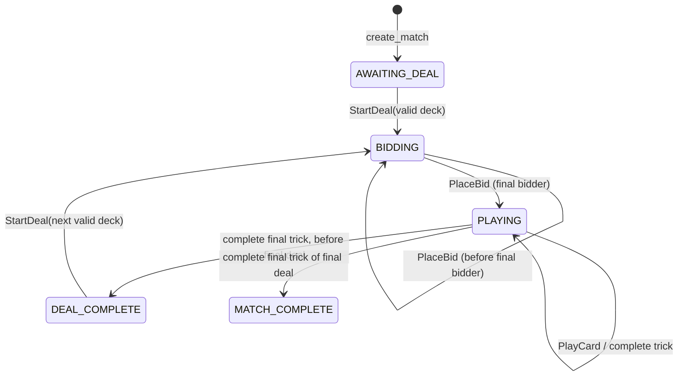

# Standalone Call Break engine design

Status: standalone core implemented. See the [implementation guide](callbreak.md) for the actual module layout and executable API. This document retains the detailed design rationale; the guide takes precedence for concrete names. Match/deal state, bidding, trick validation, scoring, card operations, hand review/redeals, settings agreement, private views, audit and versioned replay are implemented. The platform adapter remains future work. `Trick` represents both partial and completed tricks; `DealState` archives complete Trick values. Trusted restoration uses command replay (`replay.py`) instead of directly deserializing state.

Confirmed with the user: a match has exactly five deals; four players play 13 tricks per deal with four plays per trick; five players play 10 tricks per deal with five plays per trick. Every completed trick has exactly one winner. Bidding occurs at the start of every deal. Player IDs are engine-local and map to platform users outside this package.

Terminology: a **play** is one accepted card action, a **trick** contains one play from each player, a **hand** is the cards held by one player, and a **deal** consists of distribution, bidding, trick play, and scoring. Use these names consistently in models and events.

Implementation defaults for previously unresolved details: five players leave the final two shuffled cards hidden and unused. Restart rights reshuffle and redeal all hands before bidding, preserving dealer, deal number and scores. These defaults were stated when implementation began; they are not a claim that the user separately confirmed those details.

## 1. Goal and dependency boundaries

Implement a complete, deterministic Call Break match that runs in a Python script, tests, a bot simulation, or a multiplayer server. The core must not import FastAPI, Pydantic, WebSockets, authentication, rooms, persistence, asyncio, or the current `app` package. Use standard-library immutable data types and explicit inputs.

Proposed package layout:

```text
card_utils/
  __init__.py                 # Small documented public API
  cards.py                    # Suit, Rank, Card, canonical card IDs
  decks.py                    # Standard 52-card deck construction
  operations.py               # Shuffle, cut, split, combine, deal, draw
callbreak/
  __init__.py                 # Public domain API
  models.py                   # Seats, match, deal, trick, results, phases
  commands.py                 # Typed player and controller commands
  events.py                   # Public and private domain outputs
  errors.py                   # Stable domain rejection codes
  rules.py                    # Ruleset, legal cards, winning play
  scoring.py                  # Exact deal and match scoring
  engine.py                   # Pure command reducer and match creation
  views.py                    # Explicit public and player projections
  serialization.py            # Versioned trusted checkpoints and codecs
app/games/
  callbreak_adapter.py         # Future platform-to-domain translation
tests/card_utils/
tests/callbreak/
docs/callbreak-engine-design.md
```

Dependency direction: `app adapter → callbreak → card_utils → standard library`.
Card utilities never import Call Break. Neither domain package imports `app`.
Update setuptools package discovery to include `card_utils*` and `callbreak*` when implementing; an installed wheel must work outside the repository directory.

Do not introduce a generic framework for every card game. Share card manipulation now; extract other rules only when a second game needs the same behavior.

## 2. Initial ruleset

Rules vary between Call Break tables and related Call Bridge games. These are explicit proposed product defaults, not a claim of one universal ruleset. Freeze the selected ruleset for the entire match and identify it as `callbreak-v1`.

| Decision | Proposed default |
| --- | --- |
| Players | Four or five fixed seats, individually scored |
| Deck | Standard 52 unique cards, no jokers |
| Rank | 2 low, then 3–10, J, Q, K, A high |
| Trump | Spades throughout the match |
| Match length | Five deals |
| Deal | 13 cards each for four players; 10 each for five players |
| Turn direction | Player IDs 1 → 2 → … → N → 1, arranged counterclockwise by the UI |
| Dealer | Supplied at match creation; advances one seat each deal |
| First bidder / opening leader | Seat immediately after dealer |
| Bids | Integer 1–tricks_per_deal (13 or 10), sequential, public, one bid per seat |
| Combined bids | No required total |
| Leading | Any suit, including spades; no “spades broken” restriction |
| Following | Follow led suit whenever possible; beat current winning card when possible within that suit |
| Void in led suit | Play a winning spade if possible; otherwise any card is allowed |
| Trick winner | Highest spade, or highest card of led suit if no spades |
| Next leader | Winner of the previous trick |
| Successful bid | Bid plus 0.1 for each extra trick |
| Failed bid | Negative bid |
| Tie after final deal | Shared winners, no implicit extra deal or tie-break |
| Redeals | Configurable weak-hand/no-spade policy; see separate house-rule specification. Full redeal before bidding. No low-combined-bid redeal. |

The void-suit rule is deliberate: if another player has trumped and all your spades are lower, you may discard any card. A house rule requiring a losing spade is a different policy. Keep this decision isolated in `rules.py` and covered by examples.

Support a four-player profile and a custom five-player profile. Five-player dealing uses the hidden-unused policy above. Store the immutable specification/version and agreed house rules in state. Alternative overtrumping or bonus bids should become named, validated versions when requested; do not accept arbitrary client rule dictionaries during a match.

The separate [house-rule design](callbreak-house-rules.md) specifies pre-match editing and agreement, weak-hand and no-spade defaults, and the implemented pre-bid full-redeal lifecycle; the basic lifecycle below describes a deal without a redeal. When the extension is enabled, its review phase must precede bidding.

Reference context: [Pagat’s Call Bridge rules and variants](https://www.pagat.com/auctionwhist/call_bridge.html) demonstrate why related versions must be distinguished. [Call Break+ publisher description](https://apps.apple.com/us/app/call-break/id617853649) explicitly exposes a free-discard option. The table above is the implementation contract regardless of differences in external descriptions.

## 3. Reusable card utilities

### Card representation

Use a frozen `Card(suit: Suit, rank: Rank)` value. Suits are clubs, diamonds, hearts, and spades. Ranks have standard identifiers 2–14, with 11=J through 14=A. Canonical text IDs are `2C`, `10D`, `JH`, `AS`; parsing rejects invalid IDs. Provide explicit conversion functions rather than accepting many aliases silently.

Card equality is by suit and rank. Do not implement global card ordering: spades are not intrinsically stronger than hearts, and some games rank aces low. Display sorting uses an explicit key; Call Break strength belongs in Call Break rules.

For multi-deck games, two equal card values may occur. Generic sequence operations preserve duplicates and work on generic item types. A future game needing to distinguish physical copies can wrap a Card with a copy ID without changing shuffle or deal. Call Break separately enforces exactly one of each standard card.

### Operation contracts

All operations return new tuples and leave their inputs unchanged. Index zero is the top of a deck. Sequence order is meaningful. Invalid quantities reject before returning partial work. Reject booleans where an integer count is required.

| Operation | Contract |
| --- | --- |
| `standard_52()` | Return 52 unique cards in documented order: C, D, H, S, each ascending 2–A |
| `shuffle(items, *, rng)` | Fisher–Yates permutation using an injected object supporting `randrange`; no global random state |
| `cut(items, index)` | Move top `index` items to bottom: `items[index:] + items[:index]`; 0 and length are valid |
| `split(items, sizes)` | Contiguous piles of explicitly requested sizes; sizes must be nonnegative and sum to length |
| `combine(*piles)` | Concatenate in the supplied order; preserves duplicate values |
| `deal(items, players, cards_each)` | Round-robin dealing to recipient indices 0..players−1; return hands and undealt remainder |
| `draw(items, count)` | Return the top `count` items and remainder |

“Mix deck” means combining piles and then shuffling: `shuffle(combine(*piles), rng=rng)`. It does not mean removing duplicate values. An uneven split is explicit, e.g. `split(deck, (17, 17, 18))`. Cutting is a rotation; splitting preserves separate piles. A visual riffle animation is a client concern and does not define the authoritative shuffle.

For `deal`, require players > 0, cards_each ≥ 0, and enough cards. With `(A,B,C,D,E,F)`, two players and two cards each produce hands `(A,C)`, `(B,D)` and remainder `(E,F)`. The caller maps recipient zero to the first seat after dealer. Generic dealing knows no dealer or seat direction.

Tests inject `random.Random(seed)`. Live deck preparation uses `random.SystemRandom()`. Explicit ordered deck inputs, rather than seeds alone, are the replay contract. Never send the deck order, random seed, or opponents’ hands to clients.

## 4. Domain entities

Use frozen dataclasses, tuples, and enums. A frozen dataclass containing a mutable dict is not enough; nested structures must also be immutable or defensively converted.

| Type | Contents and purpose |
| --- | --- |
| `Seat` | Integer 1–N, where N is 4 or 5; independent of platform user ID |
| `Ruleset` | Immutable ID/version and selected rule values |
| `MatchState` | Schema version, ruleset, revision, phase, dealer, current deal, completed deal results |
| `DealState` | Deal number, dealer, N hands, N optional bids, undealt cards, completed tricks, current trick, bidding position |
| `TrickState` | Leader and ordered tuple of 0 through N−1 current `Play` records |
| `Play` | Seat and card |
| `CompletedTrick` | N ordered plays and exactly one winning seat |
| `DealResult` | Deal number, dealer, bids, tricks won, N score deltas and cumulative totals |
| `MatchResult` | Final totals and all tied winning seats |
| `Transition` | New immutable state and ordered domain outputs |
| `Rejection` | Stable code and safe detail; no state change |

A separate host-owned roster maps the N seats to users, bots, or local humans. Creating the match means that roster has already been established. The engine operates on seats, so a local simulation requires no fake accounts or rooms. Disconnects do not remove seats or cards.

Full authoritative state is private. Keep completed trick history for validation and checkpoint recovery; a live public view need only expose the current and most recent completed trick. Score totals should be derived from deal results, or strictly validated if cached, to prevent divergent sources of truth.

### 4.1 Ownership and component contracts

```text
MatchState — one match, exactly five deals
├── GameConfig — player count, fixed five-deal limit, ruleset, leftover policy
├── players — immutable ordered IDs (1, 2, 3, 4[, 5])
├── current_deal — optional DealState
│   ├── player_states — one PlayerDealState per player
│   │   ├── hand — remaining Card values
│   │   └── bid — optional integer until submitted
│   ├── undealt_cards — empty for four players; two for proposed five-player policy
│   ├── current_trick — optional TrickState
│   │   └── plays — ordered accepted Play values
│   └── completed_tricks — immutable CompletedTrick history
└── completed_deals — immutable CompletedDeal records, including scores and history
```

CompletedDeal archives the finished deal's player states, undealt cards, tricks, dealer, and DealResult. It is trusted engine data. Each deal is archived exactly once; `current_deal` becomes `None` after scoring. The completed_deals collection therefore grows to five without retaining a second authoritative copy of a finished deal. Views use the latest completed deal at a DEAL_COMPLETE or MATCH_COMPLETE boundary.

The model table above is a conceptual inventory; this ownership tree is the canonical storage arrangement. In particular, MatchState stores completed deal records containing results, rather than an additional independently mutable results list. Hands and bids live in PlayerDealState rather than parallel collections.

| Component | Fields / derived values | Responsibility and constraints |
| --- | --- | --- |
| `GameConfig` | `player_count`, `deals_per_match=5`, `ruleset`, `undealt_policy`; derived `cards_per_player=52 // player_count`, `tricks_per_deal=cards_per_player` | Validate N is exactly 4 or 5. Freeze configuration at creation. No mid-match change in player count. Ruleset defines scoring and play policy. |
| `PlayerId` / `Seat` | Integer 1–N | Two names for the same engine-local identifier, not separate competing identities. No user ID, socket, presence, or account data. Reject bool values. |
| `PlayerDealState` | `player_id`, `hand: tuple[Card, ...]`, `bid: int | None` | Remaining cards and one accepted bid. Hand starts with 13 or 10 cards and shrinks by exactly one per accepted play. |
| `MatchState` | Schema version, config, ordered players, initial dealer, revision, phase, current deal, completed deals | Top-level state passed into and returned by the reducer. Derive totals and match winners from completed deals. |
| `DealState` | Number 1–5, dealer, player states, undealt cards, bidding position, current trick, completed tricks | Own all card locations for this deal. Derive tricks won from completed-trick winners. |
| `TrickState` | Number, leader, ordered plays | Hold 0..N−1 accepted plays. Led suit and current winner are derived from plays. Current player is derived from leader and play count. |
| `Play` | `player_id`, `card` | Immutable accepted fact. Order and deal/trick context come from its owning history. A rejected command never creates a Play. |
| `CompletedTrick` | Number, leader, N plays, winner | Created immediately on the Nth accepted play. Exactly one play per player and one winner. Never accepts further plays. |
| `DealResult` | Bids, trick counts, score deltas in integer tenths | Final scoring evidence; totals can be derived by summing archived deltas. |
| `CompletedDeal` | Finished deal data and DealResult | Preserve every accepted play across all five deals for replay and consistency checks. |

`PlayerId` will be the preferred public domain term; existing references to Seat in the API describe the same type. An implementation should choose one exported name consistently.

### 4.2 Current player and turn ownership

Expose `current_player(state) -> PlayerId | None` as a derived query. Do not maintain independent current-player fields on Match, Deal, and Trick that can disagree.

- Before dealing, between deals, or after the match: `None`.
- During bidding: start after dealer and advance by the number of accepted bids.
- During play: start from trick leader and advance by the number of accepted plays.
- After a trick: create the next empty trick with the winner as leader, unless the deal ended.

For IDs 1..N, advancing k positions is `((player_id - 1 + k) % N) + 1`. The first dealer is supplied at match creation; deal d uses `advance(initial_dealer, d - 1)`. No random or time-based dealer selection occurs in the reducer.

The phase is authoritative on MatchState. Deal and Trick do not store additional mutable phase fields; their structure must agree with the match phase.

### 4.3 Reducer, validator, resolver, and scorer

These are separate responsibilities implemented as pure functions; they do not each own a mutable copy of state.

| Function | Inputs | Result |
| --- | --- | --- |
| `validate_bid` | State, actor, bid | Rejection or success; validates phase, turn, range and no prior bid |
| `legal_cards` | State, actor | Legal owned cards for the current turn under the selected rules |
| `validate_play` | State, actor, card | Rejection or success using the same legal_cards logic |
| `resolve_trick` | N ordered plays, ruleset | Exactly one winning player; rejects incomplete/invalid input |
| `score_deal` | N bids and N trick counts, ruleset | N exact integer score deltas; counts must sum to tricks_per_deal |
| `apply_player` | Immutable state, actor, typed command | New state and ordered events, or rejection |
| `audit_history` | Trusted initial card distribution and accepted history | Consistency result with offending deal/trick/play when invalid |

For a PlayCard command the reducer validates first, removes the card from the actor's hand, and appends the accepted Play to a new trick value. If the play count reaches N, it resolves and archives that trick atomically. If that was the final trick, it computes the deal result, archives the complete deal, and moves to DEAL_COMPLETE or MATCH_COMPLETE. Otherwise it creates the next trick led by the winner. The caller sees only the complete transition.

### 4.4 History-dependent validation and audit

Every accepted play is retained in its deal and trick context. For the current deal, derive `void_suits[player]` from occasions where that player legally played off the led suit. This knowledge lasts only for that deal, since there is no draw, exchange, or transfer of cards during play. A cached void-suit map is optional and must agree with the history; it is never a second source of truth.

The engine owns the actual hands, so an off-suit play while holding the led suit is rejected immediately. A later contradiction should be impossible through normal commands. Audit must still catch forged/restored histories where a player later plays a suit they previously claimed to lack.

Failure to beat a winning card requires context, not a permanent maximum-rank flag. Holding QH cannot beat KH, but can beat 10H later. If a trick has already been trumped, following hearts cannot beat it regardless of heart rank. Store full plays and evaluate the earlier hand and trick when auditing.

Audit reconstructs each initial hand from its remaining cards plus all that player's accepted plays for the deal (or uses a trusted initial-deal replay record). Replay bids and plays in order through the same validator, checking card conservation and recorded winners. This catches an earlier 5H played against 10H while QH was still held, even if QH was only exposed in a later trick. Compare the reconstructed final state with the checkpoint. Reconstruct the undealt pile separately; it must never enter a player's hand or a trick.

An invalid history is rejected as an invalid checkpoint/replay; it does not retroactively modify a live match. Test at least: legal later higher card, earlier failure to beat while able, off-suit then later led-suit contradiction, a trump already winning, and reset of all void knowledge at the next deal.

## 5. Lifecycle and commands



The engine has no waiting-room or connection phase. Match creation validates the initial dealer and ruleset, starts revision zero, and sets deal number zero until the first deal. `MATCH_COMPLETE` is terminal. Rematches create a fresh state.

Separate two entry points so a network player cannot submit an internal dealing command:

```python
create_match(*, initial_dealer: Seat, ruleset: Ruleset) -> MatchState
apply_player(state, actor: Seat, command: PlaceBid | PlayCard) -> Transition | Rejection
apply_control(state, command: StartDeal) -> Transition | Rejection
legal_cards(state, seat: Seat) -> tuple[Card, ...]
public_view(state) -> PublicView
player_view(state, seat: Seat) -> PlayerView
```

- `PlaceBid(amount)` is accepted only in BIDDING by the active seat. Require an actual integer 1–tricks_per_deal, not a boolean, float, or coerced string. Bids cannot be revised.
- `PlayCard(card)` is accepted only in PLAYING by the active seat, for a card in that seat’s hand and in its legal card set.
- `StartDeal(deck)` is host-only and accepted only in AWAITING_DEAL or DEAL_COMPLETE. Validate the exact 52-card multiset before any transition. Increment deal, rotate dealer only after the first deal, reset deal data, distribute hands, and select first bidder.
- `legal_cards` returns empty outside PLAYING or for an inactive seat. Reject invalid seat values. The player view may expose only that viewer’s legal cards.

A controller prepares one shuffled deck when a new deal is needed and submits it through `apply_control`. No random calls happen inside the reducer. DEAL_COMPLETE remains visible until this command; the host decides when to advance. Animations, readiness acknowledgments, delays, and timers stay outside the core.

Each accepted command increments revision exactly once, even if it produces several events. Every rejection preserves state and revision. Compute an entire transition before the caller replaces its state reference; unexpected exceptions likewise cannot leave a partially modified old state.

Suggested rejection codes: `INVALID_SEAT`, `INVALID_PHASE`, `NOT_YOUR_TURN`, `INVALID_BID`, `CARD_NOT_OWNED`, `ILLEGAL_CARD`, `INVALID_DECK`, `MATCH_FINISHED`. Unknown wire commands and malformed JSON are adapter errors. Safe details must never reveal another hand.

## 6. Legal play and trick resolution

Use a single `legal_cards` implementation for both validation and hints/bots; clients must not define authoritative legality.

1. With an empty trick, every card in the active hand is legal.
2. Otherwise determine the led suit and current winning play.
3. If the hand contains led-suit cards, restrict candidates to them. If any candidate beats the current winner, only those winning candidates are legal; otherwise all led-suit cards are legal.
4. If void in led suit, find spades that beat the current winner. If any exist, only those are legal. If none exist, all cards in hand are legal under the selected free-discard policy.

`beats(challenger, incumbent, led_suit)` lives in Call Break. A trump beats a non-trump; among trumps higher rank wins; otherwise a led-suit card beats a non-led-suit card and higher led rank wins. Off-suit non-trumps never become a winner.

Examples that pin down common ambiguities:

| Existing plays | Relevant hand | Legal cards |
| --- | --- | --- |
| `10H` | `2H, QH, AS` | `QH` only: follow and beat |
| `10H, 3S` | `2H, QH, AS` | `2H, QH`: must follow; hearts cannot beat trump |
| `10H` | `2C, 3S, AS` | `3S, AS`: void, must trump |
| `10H, 9S` | `2C, 3S, JS` | `JS` only: must overtrump |
| `10H, KS` | `2C, 3S, JS` | All three: no winning trump available |
| `9S` | `2C, 3S, JS` | `JS` only: follow spades and beat |
| `KS` | `2C, 3S, JS` | `3S, JS`: must follow spades even when losing |

After play N, resolve the winner exactly once, append the completed trick, derive the updated winner’s count from history, and clear the current trick. The winner leads next unless the final trick ended the deal. One card is removed per accepted play; completed tricks own the played cards.

## 7. Scoring and finish

Store scores as integer tenths, never binary floating-point:

```text
if tricks >= bid: score_tenths = 10 * bid + (tricks - bid)
else:             score_tenths = -10 * bid
```

Examples: bid 4 / win 6 → 42 (display 4.2); bid 4 / win 4 → 40; bid 4 / win 3 → −40. Overtricks do not compensate for another deal’s failed bid. No special high-bid bonus.

When trick 13 (four players) or trick 10 (five players) completes, compute one immutable DealResult. Before deal five, move to DEAL_COMPLETE; in deal five, also compute MatchResult and move directly to MATCH_COMPLETE. Highest cumulative total wins, including when every total is negative. Return every tied winning seat.

## 8. Events, views, and hidden information

Domain events are typed data, not the platform’s `GameEvent` model. Each output carries explicit audience metadata: `Public` or `SeatOnly(seat)`, plus state revision and its index within the command’s event batch. Audience is server-controlled metadata, never client payload data.

| Output | Audience | Contents |
| --- | --- | --- |
| `DealStarted` | Public | Deal, dealer, first bidder, hand counts |
| `HandDealt` | SeatOnly | That seat’s own 13 or 10 cards |
| `BidPlaced` | Public | Seat and bid |
| `PlayStarted` | Public | Opening leader |
| `CardPlayed` | Public | Seat, played card, trick number |
| `TrickCompleted` | Public | N plays, winner, updated trick counts |
| `DealCompleted` | Public | Bids, tricks, deal scores, totals |
| `MatchCompleted` | Public | Totals and winning seats |
| `TurnChanged` | Public | Phase and next active seat |

Ordering: deal → DealStarted, N HandDealt outputs in seat order, TurnChanged. Bids → BidPlaced, optional PlayStarted, TurnChanged. Plays → CardPlayed, optional TrickCompleted, then either TurnChanged or DealCompleted and optional MatchCompleted. No next-turn event at a deal/match terminal boundary. The next deal produces the next turn.

`PublicView` contains revision, ruleset ID, phase, deal/dealer, active seat, bids, hand counts, current/last trick, trick counts, scoreboard, and winners when finished. `PlayerView` adds only the requested seat’s hand and its legal cards. Spectators get PublicView. Views must not alias internal mutable data.

Never serialize MatchState as a client snapshot. Never place all hands in a broadcast event and rely on the browser to hide them. Authoritative checkpoints and deck-bearing replay records are separate trusted data formats, not public outputs.

## 9. Future multiplayer adapter

The current `GameRuntime` broadcasts every event to the room. Its existing GameEngine interface cannot safely deliver private hands as-is. Integration therefore requires an explicit audience-aware output contract before enabling Call Break.

Adapter responsibilities:

1. Resolve authenticated platform user to the match’s fixed seat; reject unseated actors. Ignore any client-provided seat or identity.
2. Parse platform command names/payloads into domain commands. Expose only bid and play to players. Host start/deal is a separate authorized path.
3. Validate the match ID and expected revision at the adapter boundary; reject stale commands before applying the reducer.
4. Apply the transition under the existing room lock and replace the engine state only after successful computation.
5. Translate outputs to wire models and route Public to the room, SeatOnly to that seat’s user connections **in that room**.
6. On reconnect, use a view for the authenticated seat and retain the same hand. Obtain snapshots under the same lock so the revision and cards agree.

The existing `send_to_user` sends across all rooms, so it is insufficient for private match delivery. Add room-and-user scoped delivery and tests for another tab in another room. Private recipients come from the server roster; an audience field inside incoming JSON must have no routing authority.

Use a match instance ID outside the core so rematches cannot accept old commands. Commands should include a command ID and expected revision. The adapter keeps a bounded per-match/per-actor deduplication record, returning the prior acknowledgement for identical retries and rejecting reuse with different content. Revision checking and deduplication happen atomically with transition application. Public/private event batches share a revision; clients must not assume every event index is visible to every recipient.

Network delivery failure does not undo an accepted move. Clients recover via a fresh projected snapshot; revision gaps can trigger that fetch. Exactly-once delivery, durable outbox, and server crash recovery are separate platform work. Reconnect itself does not submit a gameplay command.

Timeouts/bots, if added, select a legal domain command outside the engine and go through the same validation path. No automatic removal, replacement, forfeiture, or forced move on disconnect in the first version. A stalled game remains stalled until its player returns or a future explicit policy handles it.

## 10. Determinism, invariants, and persistence boundary

Given the same state, actor, and command—including a supplied deck—the reducer returns equal state and outputs. No wall-clock reads, UUID generation, random state, network calls, or background tasks. Record initial rules/dealer, accepted commands, and actual dealt deck orders for a trusted replay. Rejected commands need not be part of state replay.

Validate these invariants in tests and when restoring a checkpoint:

- Each active deal partitions all 52 distinct cards among hands, undealt cards, current trick, and completed tricks, without duplicates or omissions.
- Every completed trick uses N distinct seats in turn order, and recorded winners agree with rules.
- Sum of trick counts equals completed trick count; after a deal it equals tricks_per_deal (13 or 10).
- Bidding proceeds from the seat after dealer and leaves N valid bids before play.
- Played cards and hand sizes remain consistent with seat participation.
- Active seat agrees with phase, trick leader, and number of plays.
- Only legal commands change state; every success advances revision by one.
- A completed deal is scored once; match scores equal summed deal scores.
- No transition leaves MATCH_COMPLETE; no sixth deal in the initial ruleset.
- Public projections/outputs and each private projection expose only allowed information.

Checkpoint serialization is versioned and explicit, using canonical card IDs and enum values. Restore validates structure, ruleset support, and domain invariants; fail closed on unknown versions. Do not use pickle. A codec performs no disk I/O; the hosting application decides storage, access controls, and retention. Public event history alone cannot reconstruct hidden hands.

## 11. Verification and implementation sequence

1. **Card utilities:** implement immutable values and operations. Test exact small examples, card preservation, deterministic seeded shuffle, duplicate preservation, empty inputs, boundary cuts/splits, insufficient cards, and invalid counts.
2. **Rules and scoring:** implement the complete legal-play table and trick winner logic. Test follow-suit precedence, overtrumping, free discard, aces, failed/exact/exceeded bids, negative totals, and ties.
3. **Standalone reducer:** implement dealing, sequential bids, trick progression, five deals, and immutable rejection. Run full scripted matches without importing `app`.
4. **Views and replay:** test each event audience and snapshot allowlist, all N private views, spectators, checkpoint round trips at partial tricks and deal boundaries, and identical replay results.
5. **Simulation:** for many fixed seeds, deal five deals, select bids and then legal moves, and assert invariants after every command. A four-player match contains 5 deals, 20 bids, 260 plays, and 65 completed tricks; final revision is 285 from initial revision zero. A five-player match contains 5 deals, 25 bids, 250 plays, and 50 completed tricks; final revision is 280. Include targeted fixtures for rare rule branches rather than relying on random coverage.
6. **Packaging:** install the built package in a clean environment; run a standalone match from outside the repository. Verify domain imports have no dependency on the multiplayer application.
7. **Platform integration, separately:** implement room-scoped private routing, roster mapping, snapshots, retries, and the adapter. Test spoofed seats, unseated actors, stale/duplicate commands, reconnects, spectators, multiple tabs, and cross-room privacy. Retain existing chat/Echo regression coverage.

Standalone completion means a five-deal match can run and replay with only these two packages, every move and score is validated, hidden views are correct, and utilities are independently reusable. Console play becomes complete only after the audience-aware adapter and its integration tests are finished.
