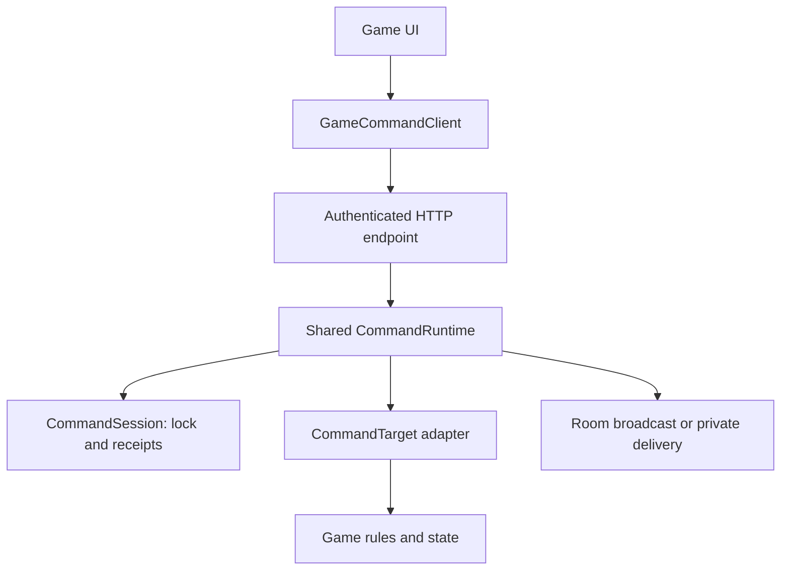

# Shared reliable command infrastructure

Call Break and the Echo test engine now use the same server command runtime and
client command interface. Games provide rules, state, and private views; they do
not implement command IDs, duplicate detection, receipts, or retry handling.

This increment generalizes the [reconnect recovery contract](reliable-game-actions.md).
It preserves Call Break's current gameplay, test-host URLs, manual turn handling, and
private-hand behavior. Storage is still in memory in one server process.

## Ownership

Room social features sit alongside the command runtime. See
[room chat and participation](room-chat.md) for the shared chat service and the
host participation contract. Chat traffic does not create game commands or
engine events; adapters remain responsible for actual game transitions.

| Component | Responsibility |
| --- | --- |
| `app/models/action.py` | Common command envelope, command-ID validation, acknowledgment schema. |
| `app/runtime/command_runtime.py` | Per-match sessions, locks, revisions, receipts, duplicate/conflict checks, checkpoint rollback, current snapshots. |
| `app/runtime/game_runtime.py` | Registered-engine routing and event delivery; exposes the shared runtime as `commands`. |
| `app/runtime/game_registry.py` | Engine and adapter ownership; one command session per registered engine lifecycle. |
| `app/transport/game_actions.py` | Authenticated room-member HTTP snapshot/action endpoints for registered adapters. |
| `app/adapters/callbreak/host.py` | Call Break seat authorization, immutable-state checkpoint, player/controller transitions, deadlines, private snapshots. |
| `app/games/echo.py` | Example adapter around the existing PING/PONG engine and counter. |
| `client/src/multiplayer/GameCommandClient.ts` | Common submit/refresh interface and HTTP transport with cancellation and timeouts. |
| `client/src/multiplayer/PendingGameAction.ts` | One unresolved intention, stable ID, acknowledgment validation, retry/error policy. |

`app/main.py` injects the same `GameRuntime.commands` instance into the Call Break
host. Receipts live in each match's `CommandSession`, not on that shared runtime
instance. Call Break and Echo can coexist in one room without sharing match IDs,
revisions, or receipts.



## Server adapter contract

A `CommandTarget` implements these synchronous hooks:

| Hook | Contract |
| --- | --- |
| `authorize(user_id)` | Check game-specific access and lifecycle; raise `CommandAccessError` for a safe pre-execution failure. Runs before receipt lookup, including retries. |
| `revision` | Current authoritative integer revision, advanced by accepted state changes. |
| `checkpoint()` | Capture every piece of state that `apply()` may change. Immutable state references are suitable; mutable state needs copies. |
| `restore(checkpoint)` | Restore that state completely after a rejection or unexpected local failure. |
| `apply(user_id, command)` | Validate semantics, perform the game transition and immediate controller work, and return `list[OutgoingEvent]`. Raise `GameCommandRejected` for expected game errors. |
| `snapshot(user_id)` | Return a JSON-compatible current view, filtered for the authenticated user, with `game.revision` for the common client. The runtime copies it and supplies the session's `match_id`. |

Hooks must not await, send messages, start external work, or perform other
irreversible side effects. Outgoing events contain a JSON dictionary and an
optional recipient **user ID**. A null recipient broadcasts within the room;
private recipients are delivered only to that user's sockets in the same room.
Adapters that use seat numbers must map them to authenticated user IDs.

All player actions, timers, settings that affect game state, and any legacy
command path must use the same `CommandSession.lock`. Never acquire that lock
before calling `CommandRuntime.execute()`, which acquires it itself. Call Break's
timer and lobby code use the session lock through `HostedGame.lock`; Echo's
legacy WebSocket PING handler uses it through `RoomGame.lock`.

### Registering another game

Use `EchoCommandTarget` as the smallest working example. After implementing the
hooks for a game, register its engine and adapter at the composition root:

```python
from app.games.echo import EchoCommandTarget, EchoGameEngine

engine = EchoGameEngine()
registry.register(room_id, engine, command_target=EchoCommandTarget(engine))
```

The registration immediately supports the shared HTTP endpoints. A legacy engine
registered without `command_target` keeps its existing WebSocket behavior; the
reliable endpoints reject it with HTTP 409 until an adapter is supplied. The
registry does not implicitly wrap arbitrary mutable engines or permit replacing
an existing room entry.

A host with its own match lifecycle can use the same runtime directly, as Call
Break does:

```python
result = await runtime.commands.execute(
    match.commands, target, authenticated_user_id, command, deliver_events,
)
```

Allocate one `CommandSession` when creating the match and retain it across socket
disconnects. The host validates room membership before dispatch. The target
must reject obsolete/removed matches before returning a cached receipt. Create
a new session and match ID when replacing a completed match.

### Transaction order

Under the session lock, the runtime checks match and game authorization, then
looks up a receipt using `(authenticated_user_id, command_id)`. A repeated ID with
different command content fails before mutation. A matching ID returns the old
acknowledgment alongside a current private snapshot, even if the revision has
advanced.

For a new request it checkpoints the target, checks the expected revision,
applies the transition, validates event JSON, and records acceptance or game
rejection. Unexpected local errors restore the checkpoint and do not create a
receipt. Only then can network delivery yield. Cancellation or a send failure
after that point leaves a recorded outcome for retry. Duplicate requests do not
redeliver events or extend deadlines.

The lock covers event delivery to preserve per-match ordering. This is an
in-memory transaction, not durable storage or exactly-once network delivery.
Snapshots recover state when clients miss part of an event batch.

## HTTP integration

| Endpoint | Engine and behavior |
| --- | --- |
| `GET /games/{room_id}` | Current snapshot for the registered command target; Echo is registered by the current app. |
| `POST /games/{room_id}/action` | Shared command envelope; `command_id` is required. |
| `GET /test-games/{room_id}` | Existing Call Break snapshot, including spectators. |
| `POST /test-games/{room_id}/action` | Existing Call Break payload validation and seat authorization, followed by the same shared runtime. Optional IDs remain supported only for legacy callers. |

All four require a bearer token and current room WebSocket membership. Actions
return the game snapshot plus `action_ack`; game rejections with IDs also use
HTTP 200 and `status: "rejected"`. Authentication, access, and malformed-envelope
failures use HTTP errors. See the [wire contract](reliable-game-actions.md#http-contract)
for field details and retry policy.

For example, after joining a room, fetch `/games/{room_id}` to get its Echo
match ID and revision, then send:

```json
{
  "match_id": "value-from-snapshot",
  "command_id": "unique-client-intention-id",
  "expected_revision": 0,
  "command": "PING",
  "payload": { "message": "hello" }
}
```

Use the fetched revision rather than assuming zero. Retrying the exact body
returns the same acknowledgment and current counter, without another PONG.
Existing WebSocket `GAME_COMMAND` messages remain the legacy path and do not
provide receipts. Mixing a legacy PING with reliable PING advances the same
engine revision, so stale reliable intentions are rejected normally.

## Common client interface

Each mounted room/identity owns one `GameCommandClient<TSnapshot>`. Its generic
snapshot needs only `match_id`, `game.revision`, and optional `action_ack`;
hands, scores, boards, and other fields stay game-specific.

```typescript
const transport = createHttpGameTransport<EchoSnapshot>(
  `${apiUrl}/games/${encodeURIComponent(roomId)}`, token,
);
const commands = new GameCommandClient(transport);

let { snapshot } = await commands.refresh(signal);
if (commands.submit(snapshot, 'PING', { message: 'hello' })) {
  const result = await commands.refresh(signal);
  snapshot = result.snapshot;
  // Render result.error for a definitive rejection.
}
```

For Call Break, supply its snapshot type and `/test-games/{room_id}` base URL.
`submit()` creates an intention and returns false if another action is pending
or the snapshot has no active match/revision. `refresh()` fetches a new snapshot,
then reconciles the exact pending request. `pending` tells the UI to disable
new submissions. It does not optimistically mutate game state.

The room UI owns polling and reconnect scheduling: call `refresh()` when
connected, again after submission, and after a network error/reconnect. Abort
the previous effect when changing connection or leaving. Keep the client instance
stable during reconnect; replace it when the room, server, or identity changes.
Call Break uses `useMemo` for this ownership and retains its one-second polling.

The provided HTTP transport shares bearer headers, serialization, ten-second
timeouts, abort forwarding, and HTTP error classification. A different transport
can implement just `snapshot(signal)` and `action(body, signal)`. Lobby requests
can use the HTTP transport's `request()` method but are not automatically retried.

Snapshots started before a new intention cannot dispatch it. Canceled or late
duplicate responses cannot clear a newer intention. Pending actions stay only in
memory; leaving/unmounting or refreshing discards them as documented in the
[persistence limits](reliable-game-actions.md#persistence-limits).

## Verification and limits

Validation on September 11, 2026: the full 249-test backend suite passed, then the
expanded 13-test shared runtime suite passed. All 27 client tests, TypeScript
checking, and the web export passed. Backend dependency deprecation warnings
remain. Browser interruption and native-device UI checks were not performed.

`tests/test_shared_commands.py` runs the same duplicate, cancellation, rejection,
capacity, authorization-recheck, and rollback tests against both real adapters.
It also checks both HTTP routes, credential reuse on reconnect, private delivery,
receipt isolation, and coexistence with legacy commands. The existing full
four/five-player Call Break tests continue to check gameplay and private hands.

`client/tests/game-command-client.test.mjs` exercises the same HTTP client with
Call Break and Echo payloads/snapshots, including response loss and replacement
matches. It also covers cancellation and late-response races. Run the backend
suite, client tests, typecheck, and web build using the commands in the
[recovery guide](reliable-game-actions.md#verification).

This does not add persistence, multi-worker coordination, a universal lobby,
new game rules, or production Call Break deployment. Receipts are capped at
10,000 per match without eviction, and backend restart clears all state. The
next game needs an adapter and UI, but should add no reliability bookkeeping.
